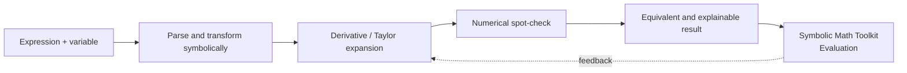

# Symbolic Math Toolkit architecture

## System map

## Stage responsibilities

| Stage | Responsibility | Review question |
|---|---|---|
| Input | Define the domain payload and units | Is provenance and timestamp semantics explicit? |
| Validation | Reject malformed or leaked information | Can the contract fail loudly? |
| Method | Transform inputs into a prediction or decision | Is the baseline inspectable? |
| Output | Return a typed result with uncertainty where relevant | Can a downstream user understand the result? |
| Evaluation | Measure quality and failure modes | Are splits, metrics, and limitations documented? |

## Design principle

Keep domain assumptions at the boundary, keep the core deterministic where possible, and make the failure path as visible as the success path.
